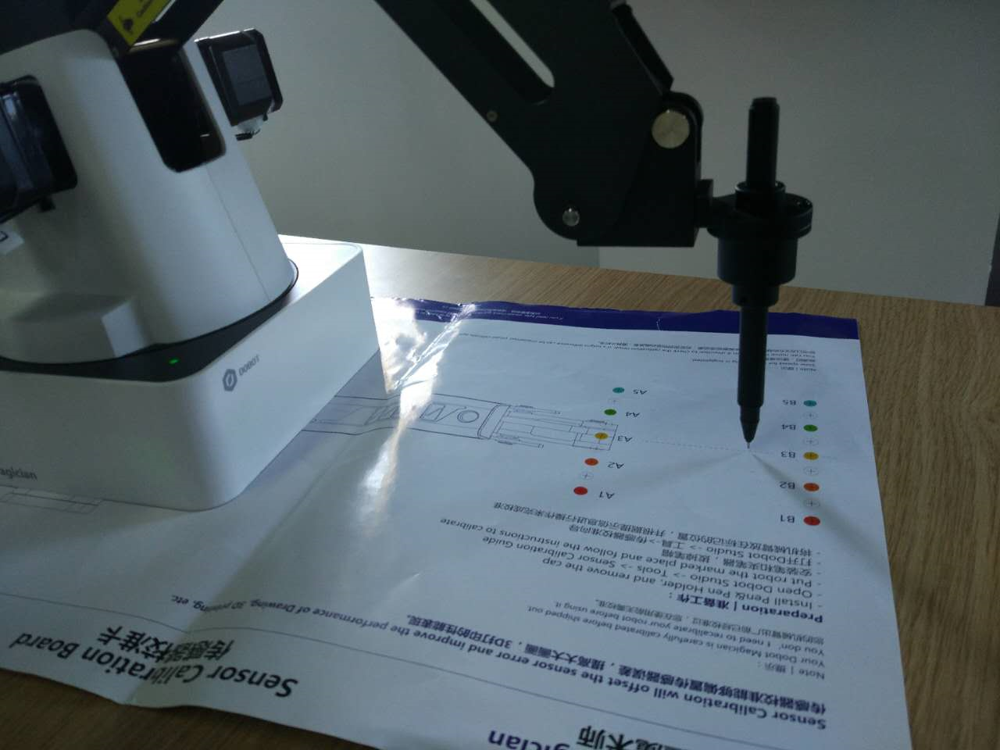
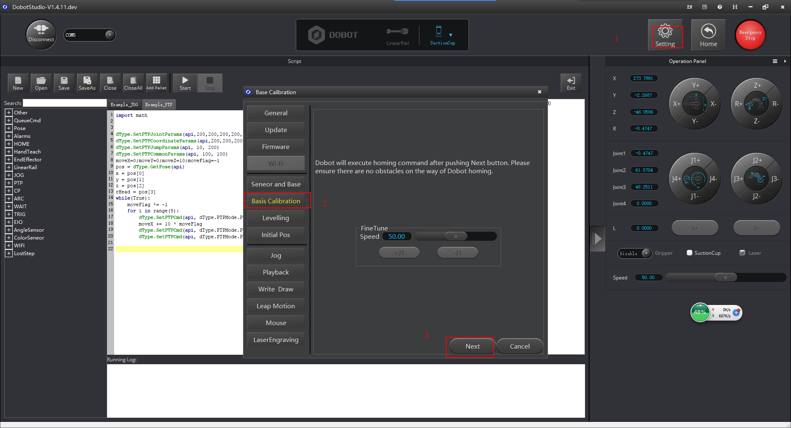
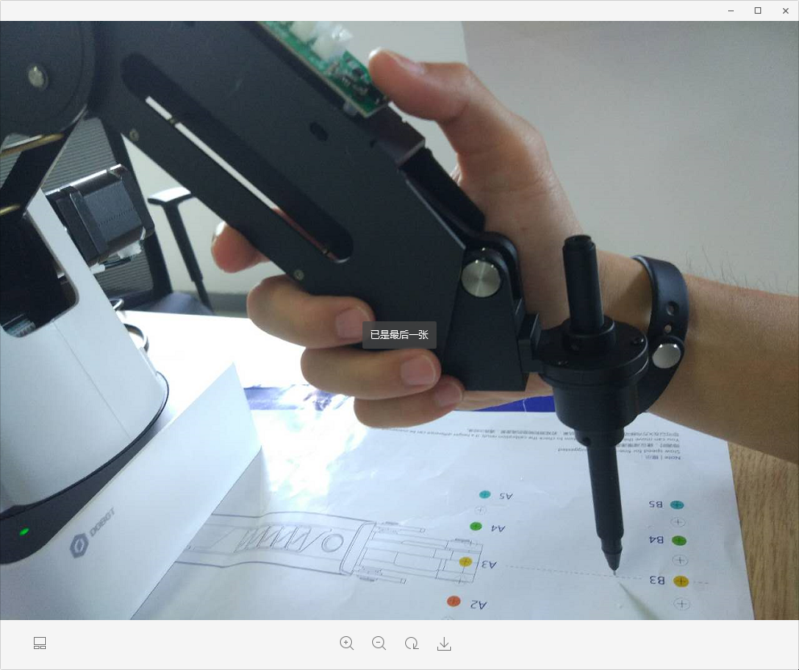
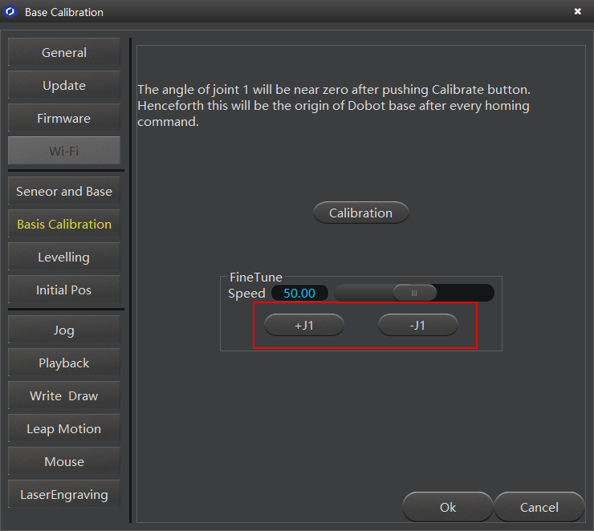
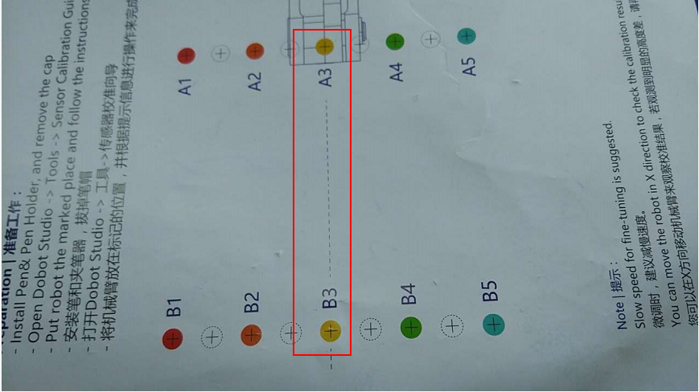

# 底座校准
底座在使用中可能出现Y轴的0位置不在机械臂的中心位置，此时则需要用底座校准来进行调整
1.底座校准需要用到笔和校准纸
****
配图用到的配件

****
2.在设置里面打开底座校准页面，点击下一步，机械臂会先执行回零的操作
****

****
3.手持机械臂移动到离校准纸大概2-3mm的高度，
****

****
然后调节J1±来进行微调
****

****
4.笔尖对准校准纸的中间线则可以点击校准来确认底座基准
****

****